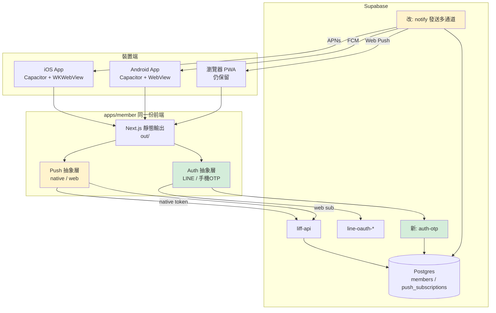
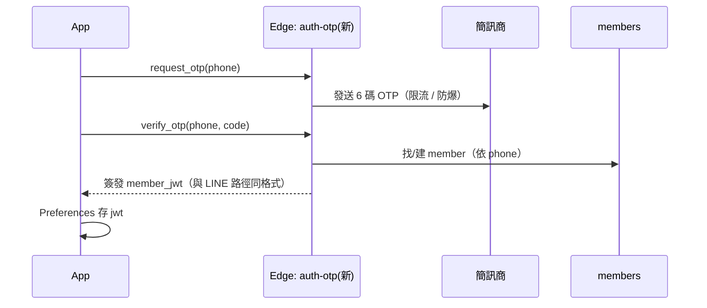
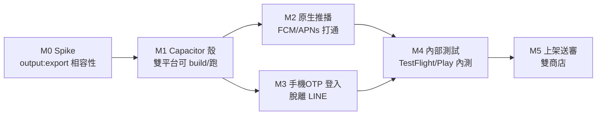

# PRD — 會員行動 App（Android / iOS，Capacitor）

> 狀態：**v0.2 實作中**（M0 spike 通過、Capacitor 殼 + 原生推播前端 + DB migration 已落地）
> 範圍：**會員 / 消費者端**（`apps/member`）
> 技術路線：**Capacitor 包現有 Next.js PWA**
> 三大目標：①上架 App Store + Google Play ②原生推播通知（APNs / FCM）③脫離 LINE 依賴
> 撰寫：2026-06-06

---

## 實作進度（2026-06-06）

| 項目 | 狀態 | 產物 |
|------|------|------|
| **M0 spike：`output: export` 相容性** | ✅ 完成 | 全 16 頁靜態輸出成功 |
| 唯一阻礙：`/shop/c/[id]` 動態路由 | ✅ 改為 `/shop/c?id=`（query param + Suspense） | `apps/member/src/app/shop/c/page.tsx` |
| `output: export`（環境變數切換，不影響 web 部署） | ✅ | `apps/member/next.config.ts`、`build:export` script |
| **Capacitor 殼專案** | ✅ 骨架完成 | `apps/member-app/`（config + scripts + README） |
| 平台偵測 + 原生推播抽象層 | ✅ | `apps/member/src/lib/platform.ts`、`nativePush.ts` |
| 推播 hook 原生分流（web/native） | ✅ | `usePushNotification.ts`（新增 `isSubscribed`） |
| `push_subscriptions` 原生欄位 + RPC | ✅ migration 已寫（**未部署**） | `supabase/migrations/20260606120000_push_subscriptions_native.sql` |
| `liff-api: upsert_push_subscription` 收原生欄位 | ✅ | `supabase/functions/liff-api/index.ts` |
| **`cap add ios/android` + 簽章 + 送審** | ⏳ 待 dev 機（需 macOS/Xcode、Android SDK） | 見 `apps/member-app/README.md` |
| **發送端多通道（FCM/APNs）** | ⏳ 待做（需憑證） | §5.4 |
| **脫離 LINE：手機 OTP 登入** | ⏳ 待做（需選簡訊商，§9） | §6 |
| Session 改 Preferences/Keychain | ⏳ 後續（native WebView localStorage 暫可用） | §6.4 |

> 已在本 Linux 環境驗證：`NEXT_OUTPUT_EXPORT=1 npm run build:export` 成功產出
> `apps/member/out`（含 `sw.js`、`manifest.json`、`shop/c/index.html`），TypeScript 全綠。
> **無法**在此環境驗證的：iOS/Android 原生 build（需 Mac/SDK）、實機推播。

---

## 0. TL;DR

把現有的 `apps/member`（Next.js 16 PWA + LINE LIFF）用 **Capacitor** 包成原生殼，
重用約 95% 既有前端程式碼，分三條 workstream 並行推進：

| WS | 主題 | 核心改動 | 對使用者的價值 |
|----|------|----------|----------------|
| **A** | Capacitor 殼 + 雙商店上架 | 新增 `apps/member-app` Capacitor 專案、靜態打包、簽章、商店送審 | App Store / Google Play 有獨立 app、品牌曝光 |
| **B** | 原生推播 | Web Push(VAPID) → 原生 FCM/APNs token；`push_subscriptions` 加 `provider` 欄；發送端 Edge Function 多通道 | 離開 LINE / 關掉瀏覽器也收得到到貨、促銷推播 |
| **C** | 脫離 LINE 依賴 | 新增「手機 OTP 獨立登入」路徑，與 LINE 登入並存；JWT 簽發解耦 | 不必在 LINE 內開啟、非 LINE 用戶也能用 |

**不需要重寫前端 UI**，三條都建立在現有 `apps/member` 之上。

---

## 1. 背景與現況盤點

### 1.1 現況

- **後端**：Supabase（Postgres + RPC + Edge Functions），會員模組 / 通知模組已上線。
- **`apps/member`**：Next.js 16 + React 19 + Tailwind 4 的 **PWA**。
  - 已有 `manifest.json`、Service Worker（Serwist，`src/sw.ts` → `public/sw.js`）、Web Push（VAPID）、Android/iOS icons。
  - 頁面：`/shop`、`/orders`、`/wallet`、`/me`、`/notifications`、`/settlements`、`/overview`、`/register`、`/install`。
  - 資料存取：client 端直接打 Supabase Edge Function `liff-api`（帶自簽 `member_jwt`）。
- **登入流程（目前）**：
  ```
  LINE OAuth (line-oauth-start) → line-oauth-callback 簽發 member_jwt
    → 寫進 URL fragment → consumeFragmentToSession() 存 localStorage
    → 跨視窗用 BroadcastChannel 同步；PWA 用 6 碼 claim_pwa_auth_code 配對
  ```
  `member_jwt` 為**自簽 JWT**（非 Supabase Auth），client 只解 `exp` 判過期。
- **推播（目前）**：`usePushNotification.ts` 用 VAPID `applicationServerKey` 向瀏覽器 Push Service 訂閱，
  `endpoint/p256dh/auth` 經 `liff-api: upsert_push_subscription` 寫入 `push_subscriptions`。
  - 痛點：**iOS 僅 16.4+ 且必須「加入主畫面」**後才可訂閱，安裝引導摩擦大、轉換率低。

### 1.2 既有資產可重用度

| 資產 | 重用 | 說明 |
|------|------|------|
| 所有 React 頁面 / 元件 | ✅ 100% | UI 不動 |
| Supabase Edge Function `liff-api` 等 | ✅ | API 合約不變 |
| `manifest.json` / icons | ✅ | 殼用同一套圖示 |
| Service Worker（Serwist） | ⚠️ 部分 | 原生殼內走 Capacitor 推播，SW 推播降為「瀏覽器 PWA」分支保留 |
| Web Push 訂閱邏輯 | ⚠️ 改造 | 抽象成 provider，新增原生分支 |
| LINE 登入 | ✅ 保留 | 仍是登入選項之一，但不再是唯一 |

---

## 2. 為什麼選 Capacitor（vs 其他）

| 方案 | 重用現有碼 | 原生體驗 | 上 App Store | 工期 | 結論 |
|------|-----------|----------|--------------|------|------|
| **Capacitor 包 PWA** | ~95% | 中（WebView + 原生外掛） | ✅ | 短 | **採用** |
| React Native / Expo | ~30%（僅邏輯） | 高 | ✅ | 長 | 等於重寫前端 |
| Flutter | ~0% | 高 | ✅ | 最長 | 換語言、脫離 TS 生態 |
| 純 PWA + Android TWA | 100% | 低 | ❌ iOS | 最短 | iOS 無法上 App Store，被排除 |

選 Capacitor 的關鍵理由：前端已是成熟 PWA，Capacitor 讓我們**保留同一份程式碼**，只在需要原生能力（推播、相機、Haptics、安全儲存）的地方插入外掛，且一份碼同時產出 iOS + Android。

---

## 3. 目標架構



### 打包策略：靜態輸出 bundle（不要 server.url 指遠端）

- 採 `next build` + **`output: 'export'`** 產生 `out/`，由 Capacitor 打包進 app（`webDir: '../member/out'`）。
- **不**用 `server.url` 指向線上網站當殼 —— Apple App Review **Guideline 4.2** 會把「只包一個網站」的 app 退件；bundle 靜態資源 + 原生外掛才是安全做法。
- 需先盤點 `apps/member` 是否有 SSR / route handler / `next/image` 最佳化等不相容 `output: export` 的用法（見 §7 風險）。資料本來就 client 端打 Edge Function，靜態輸出衝擊小。

---

## 4. Workstream A — Capacitor 殼 + 雙商店上架

### 4.1 專案結構

```
apps/
  member/         ← 既有 Next.js（前端唯一真實來源）
  member-app/     ← 新增 Capacitor wrapper
    capacitor.config.ts   (appId: com.baozima.member, webDir 指 ../member/out)
    ios/                  (Xcode 專案)
    android/              (Gradle 專案)
    package.json
```

加上 root `package.json` script：`build:app`（先 `next build` export 再 `cap sync`）。

### 4.2 必要外掛

| 外掛 | 用途 | 對應 §目標 |
|------|------|-----------|
| `@capacitor/push-notifications` | 原生 APNs/FCM token | WS B |
| `@capacitor/app` | deep link / 返回鍵 / 生命週期 | A/C |
| `@capacitor/browser` | LINE OAuth 用系統瀏覽器（不在 WebView 內登 OAuth） | C |
| `@capacitor/preferences` | 取代 localStorage 存 `member_jwt`（原生持久化） | C |
| `@capacitor/haptics`、`@capacitor/status-bar`、`@capacitor/splash-screen` | 原生質感 | A |
| `@capacitor/barcode-scanner`（選） | 未來取貨核銷掃碼 | 後續 |

### 4.3 上架前置（兩商店）

**Apple App Store**
- Apple Developer Program（US$99/年）、App ID、Bundle ID = `com.baozima.member`。
- APNs Key（.p8）供推播。
- App Privacy「營養標籤」、隱私權政策 URL、刪除帳號流程（Apple 強制要求 app 內可刪帳號）。
- 審查重點：4.2 最低功能性（不可只是網站殼）、5.1.1 帳號/隱私、若保留「用 LINE 登入」且有其他第三方登入，留意 4.8 Sign in with Apple 要求（見 §7）。

**Google Play**
- Play Console 帳號（US$25 一次性）。
- App signing（Play App Signing）、`com.baozima.member`。
- Data safety 表單、隱私權政策、目標 API level 合規。
- FCM 專案（`google-services.json`）供推播。

### 4.4 驗收
- iOS / Android 各自能 build 出可安裝包（.ipa / .aab）。
- 冷啟動進首頁、登入、看商品、下單、看通知全流程通。
- TestFlight + Play 內部測試軌道各放一版。

---

## 5. Workstream B — 原生推播（Web Push → APNs/FCM）

### 5.1 為何要換
Web Push 在 iOS 限制重（16.4+、必須加入主畫面、權限轉換低）。原生殼改用
`@capacitor/push-notifications`：Android 走 **FCM**、iOS 走 **APNs**，權限與到達率都正常。

### 5.2 前端：Push 抽象層

把現有 `usePushNotification.ts` 重構成 provider 介面：

```
getPushProvider():
  if Capacitor.isNativePlatform() → NativePushProvider  (FCM/APNs token)
  else                            → WebPushProvider      (現有 VAPID 邏輯)
```

`NativePushProvider`：
1. `PushNotifications.requestPermissions()` → `register()`
2. 監聽 `registration` 事件拿 **device token**
3. 呼叫 `liff-api: upsert_push_subscription`，但帶新欄位 `provider: 'fcm' | 'apns'`、`device_token`（取代 web 的 endpoint/p256dh/auth）

### 5.3 後端 DB migration（append-only，遵守 CLAUDE.md）

`push_subscriptions` 擴欄（**先 grep 既有 migration 找最新版本為基底**：
`20260603000000_push_subs_unique_per_member.sql` 等）：

```sql
ALTER TABLE push_subscriptions
  ADD COLUMN IF NOT EXISTS provider     TEXT NOT NULL DEFAULT 'webpush',  -- webpush | fcm | apns
  ADD COLUMN IF NOT EXISTS device_token TEXT,            -- 原生 token（web 為 NULL）
  ADD COLUMN IF NOT EXISTS app_version  TEXT,
  ADD COLUMN IF NOT EXISTS platform     TEXT;            -- ios | android | web
-- web 仍用 endpoint/p256dh/auth；原生用 device_token
-- 唯一鍵調整：每 member × (provider, device_token|endpoint) 一筆
```
> migration 檔頭註記「以哪個版本為基底、rollback 指回哪版」。

### 5.4 後端發送端：多通道

現況用 `web-push` 套件（見 `PWA_SETUP.md`）。改造通知發送（admin-notify / 通知模組 Edge Function）為依 `provider` 分流：

```
for sub in subs:
  match sub.provider:
    'webpush' → web-push (現有，保留)
    'fcm'     → FCM HTTP v1 (service account)
    'apns'    → APNs (token-based, .p8 key)
```

- 新增 secrets：`FCM_SERVICE_ACCOUNT_JSON`、`APNS_KEY_P8` / `APNS_KEY_ID` / `APNS_TEAM_ID` / `APNS_BUNDLE_ID`。
- 失敗（token 失效 → 410/NotRegistered / Unregistered）時把該 sub 標記停用，避免重送。

### 5.5 驗收
- iOS 實機（TestFlight）、Android 實機，app 在**背景 / 關閉**狀態收得到推播。
- 點推播能 deep link 進對應頁（如 `/orders/:id`）。
- 同一會員多裝置都收到；舊 token 失效自動清。

---

## 6. Workstream C — 脫離 LINE 依賴

### 6.1 目標
現在登入唯一入口是 LINE OAuth，且 PWA 安裝要靠「6 碼配對」繞 LINE 內建瀏覽器限制。
原生 app 要能：①不在 LINE 內也能直接登入 ②非 LINE 用戶也能註冊使用。
LINE 登入**保留為選項之一**，不是移除。

### 6.2 新增「手機 OTP 登入」（推薦主路徑）

會員主檔本來就以**手機號**為主識別（見 `PRD-會員模組`），故獨立登入用手機 OTP 最自然。



- **關鍵**：`auth-otp` 簽發的 `member_jwt` 與 `line-oauth-callback` **同一把私鑰、同一 claims 結構**，
  下游 `liff-api` 完全不用改，登入來源對 API 透明。
- 簡訊商選型（待決，見 §9）：Twilio / 雲端電信 / 台灣本地簡訊商。需含**限流與防濫用**（同號碼/同 IP 頻率、OTP 5 分鐘過期、嘗試次數上限）。
- 帳號合併：若該手機已有 LINE 綁定的 member，OTP 登入應命中同一 member（沿用既有 `rpc_merge_member` 思路，避免重複帳號）。

### 6.3 LINE 登入在原生殼的調整
- 用 `@capacitor/browser` 開系統瀏覽器走 OAuth，callback 透過 **deep link / universal link**（`com.baozima.member://auth` 或 `https://<domain>/auth/success`）回到 app，取代現行「6 碼配對」繞道。
- `consumeFragmentToSession` 改為也接受 deep link 帶回的 token。

### 6.4 Session 儲存
- 原生平台 `member_jwt` 從 `localStorage` 改存 `@capacitor/preferences`（更穩、可選 keychain/keystore）。抽一層 `sessionStore`，web 仍用 localStorage。

### 6.5 驗收
- 全新裝置、**未裝 LINE**，用手機 OTP 能註冊 + 登入 + 下單。
- 既有 LINE 會員用同手機 OTP 登入 → 命中同一 member、看得到歷史訂單/錢包。
- LINE 登入在原生殼也能正常完成（deep link 回 app）。

---

## 7. 風險與待解技術點

| 風險 | 影響 | 緩解 |
|------|------|------|
| Next.js `output: export` 不相容（SSR / route handler / `next/image`） | 打不出靜態 bundle | 先做相容性 spike：列出所有 server-only 用法，`images.unoptimized` 已開；必要處改 client fetch |
| Apple 4.8「Sign in with Apple」 | 若提供 LINE 等第三方登入，Apple 可能要求一併提供 Sign in with Apple | 主推「手機 OTP」屬於自家登入，通常可免；若仍被要求則加 Apple 登入路徑 |
| Apple 4.2 純網站殼退件 | iOS 上不了架 | bundle 靜態資源 + 用原生外掛（推播/相機/haptics），非 `server.url` |
| 強制「app 內刪除帳號」 | 審查退件 | 在 `/me` 加刪帳號流程，串會員模組 GDPR 軟刪除 |
| APNs / FCM 憑證維運 | 推播中斷 | secrets 集中管理、憑證到期提醒 |
| OTP 簡訊濫用 / 成本 | 被刷簡訊、費用爆 | 限流、圖形/裝置驗證、每日上限、監控 |
| Service Worker 與原生推播雙跑 | iOS WebView 行為不一 | 原生平台停用 Web Push 分支，只走 Capacitor 推播 |
| 商店審查反覆 | 上架時程不定 | 預留審查緩衝、先上內部測試軌道 |

---

## 8. 里程碑（建議順序）



- **M0** 必須最先做（決定整條路線可行性）。
- **M2 / M3** 可並行（不同人 / 不同 Edge Function）。
- 每個里程碑沿用 repo 慣例補 `docs/TEST-*.md` 驗證報告。

---

## 9. 待決問題（Open Questions）

1. **App 識別名 / Bundle ID**：`com.baozima.member` 可用嗎？商店顯示名沿用「包子媽生鮮小舖」？
2. **簡訊商**：用哪家？預算 / 台灣門號到達率 / 是否已有現成帳號？
3. **Apple Developer / Google Play 帳號**：公司帳號是否已申請？由誰持有？
4. **LINE 登入去留**：原生 app 是「OTP 為主、LINE 為輔」還是「兩者並列」？
5. **刪除帳號**：GDPR 軟刪除流程是否已可在前端觸發（會員模組現況）？
6. **多店 context**：現行 `member_store_id` 在無 LINE 入口時，新用戶怎麼決定歸屬門市（掃 QR？選店？）。
7. **CI/CD**：是否要 EAS-like / Fastlane 自動化雙商店出包？或先手動。

---

## 10. 對既有程式碼的具體落點（給實作者）

| 檔案 / 位置 | 動作 |
|-------------|------|
| `apps/member/next.config.ts` | spike 後加 `output: 'export'`（確認 Serwist 相容） |
| `apps/member/src/lib/usePushNotification.ts` | 抽 provider，新增 NativePushProvider |
| `apps/member/src/lib/session.ts` | 抽 `sessionStore`（web localStorage / native Preferences）；支援 deep link token |
| `apps/member/src/app/me/page.tsx` | 加「刪除帳號」「登入方式」入口 |
| `apps/member-app/`（新） | Capacitor 專案、iOS/Android 平台 |
| `supabase/functions/auth-otp/`（新） | request_otp / verify_otp，簽發 member_jwt |
| `supabase/functions/liff-api/index.ts` | `upsert_push_subscription` 收 `provider/device_token/platform` |
| `supabase/functions/admin-notify`（或通知發送 EF） | 依 provider 分流 web-push / FCM / APNs |
| `supabase/migrations/<new>_push_subscriptions_native.sql` | 擴欄 provider/device_token/platform（檔頭註記基底版本） |
| `package.json`（root） | `build:app` script |

---

> 下一步：先回答 §9 待決問題，並對 §7 第一項（`output: export` 相容性）做 M0 spike，再開 WS A 的 Capacitor 殼。
</content>
</invoke>
