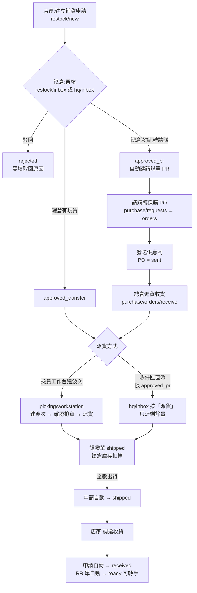

# SOP:分店補貨流程 — 總倉操作手冊

> 2026-07-17 起適用。本文對應 20260717000000_restock_wave_status_sync.sql 上線後的行為:
> 補貨申請的狀態會隨出貨/收貨**自動推進**(直派與撿貨波次兩條路徑皆是),總倉不需要手動改狀態。

## 流程總覽

單據狀態對照(全程自動,無需手動改):

| 節點 | 補貨申請 | 其他單據 |
|---|---|---|
| 店家送出 | `pending` | 同步建 ride-along 訂單 `RR-<id>`(pending) |
| 審核:有貨 | `approved_transfer` | — |
| 審核:轉請購 | `approved_pr` | PR 建立(≤ 審核門檻自動核准)、PO 轉出後 PR = `fully_ordered` |
| 供應商到貨 | 不變 | 進貨單 confirmed、PO = `partially/fully_received` |
| 派貨(全數出貨) | `shipped` | 波次 = `shipped`、調撥單 = `shipped` |
| 店家收貨(全數到店) | `received` | 調撥單 = `received`、`RR-<id>` = `ready` |

---

## 總倉要做的步驟

### 步驟 1:審核補貨申請

- **畫面**:`restock/inbox`(補貨收件匣)或 `hq/inbox`(總倉收件匣)。
- 逐張看店家申請的品項/數量/備註,三選一:
  - **總倉有現貨** → 核准為「直接調撥」(`approved_transfer`),之後走撿貨工作台派貨。
  - **總倉沒貨** → 核准為「轉請購」(`approved_pr`),系統自動建請購單(PR),金額低於審核門檻(現行 5,000)自動過審。
  - **駁回** → 必須填駁回原因。
- 核准當下系統會同步鎖定分店價;品項沒設分店價/成本價的,後面派貨會被擋,建議審核時順手補價。

### 步驟 2(轉請購路徑):請購 → 採購 → 發送供應商

- **畫面**:`purchase/requests`(請購單)→ 轉採購 → `purchase/orders`(採購單)。
- 把請購單品項拆給供應商成採購單(PO),確認後**發送**給供應商(PO = `sent`)。
- 同一張 PO 可以彙整多張請購(補貨 + 開團需求),之後撿貨時系統會自己對回需求歸屬。

### 步驟 3(轉請購路徑):供應商到貨,總倉收貨

- **畫面**:`purchase/orders/receive`(採購進貨)。
- 依實到數量建進貨單並確認(goods receipt = `confirmed`),PO 變 `partially_received` / `fully_received`,總倉庫存增加。
- **注意**:只有「已確認進貨」的量才算可派貨量,撿貨工作台的可分配量 = 進貨量 − 已派量。

### 步驟 4:派貨給分店(二擇一,可混用)

兩條路都有**防重複派貨守衛**(20260715 起):只能派「申請量 − 已派量」,派完就擋。

**4a. 撿貨工作台建波次(主路徑,適合多店/多品項一起出)**

- **畫面**:`picking/workstation`(派貨工作台)。
- 有 PO 的:「按 PO 建撿貨單」,把到貨量分配給各店(補貨需求會自動歸屬,超派會被擋)。
  沒 PO 的(`approved_transfer` 現貨補貨):在補貨區塊按該申請建撿貨單,只能派給申請店。
- 列印撿貨單(`picking/print-pick-list`)→ 倉內撿貨 → 回系統**確認撿貨完成**(波次 = `picked`,可修實撿量)。
- 按**派貨**:系統對每家店自動產生調撥單(單號 `WAVE-<波次>-S<店>`)、即時出貨扣總倉庫存(波次 = `shipped`)。
  - 出貨前守衛:品項缺成本價/分店價會整張擋下,先補價再派。
  - 派完後,**全數出貨的補貨申請自動變「已出貨」**;只派一部分的,申請保持核准狀態,剩餘量可再建波次或走直派。
- 需要簽收單就印 `picking/print-sign`。

**4b. 收件匣直派(適合單店少量、貨已在總倉)**

- **畫面**:`hq/inbox` 對狀態「已核准轉請購」的申請按**派貨**。
- 系統只直派「還沒透過撿貨單派出的剩餘量」,直接建一張已出貨的調撥單;全部已由波次派完的會擋下並提示。

### 步驟 5:店家收貨(店端操作,總倉只需追蹤)

- 店家在調撥收貨頁(`transfers/inbox`)逐張或批次收貨 → 調撥單 = `received`、店倉庫存增加。
- 收貨當下系統自動:
  - 補貨申請 →「已收貨」(全數到店時;還有別張在途就先停在「已出貨」)。
  - ride-along 訂單 `RR-<id>` → `ready`,店家即可在訂單頁把這批貨**轉手**賣給真會員(鎖現售價)。
- 店家收錯可「退回收貨」:庫存沖銷、申請退回「已出貨」、RR 單退回 pending(貨已被賣掉/取走則擋)。
- **總倉追蹤點**:出貨超過 2–3 天仍未收的在途調撥(`wms/transfers` 可查),主動催店家收貨 —— 未收貨會拖住月結與申請結案。

### 步驟 6:月結對帳

- **畫面**:`transfers/settlement`(總倉月結算)。
- 依當月已收貨的調撥明細產生各店月結算單,店端在對帳頁核對後確認;爭議走 dispute 流程。

---

## 常見問題

- **申請卡在「已核准」但貨其實到店了?** 舊缺口,2026-07-17 已修:波次路徑現在會自動推「已出貨/已收貨」,並已 backfill 存量卡單(33 張補推已收貨、17 張補推已出貨,含 PR2607070440 / 補貨 #46)。再看到卡單請回報,不要手動改狀態。
- **同一張申請可以又建波次又直派嗎?** 可以,守衛會自動只放行剩餘量;想多給店貨,走內部調撥(`transfers/dispatch`),不要硬塞進補貨單。
- **派貨被「缺成本價/分店價」擋下?** 去商品頁 SKU 區塊或工作台補價後重派;這是避免月結算出 0 元的保護。
- **取消申請?** `pending` 可整張取消;已核准後只能逐條取消「還沒派出」的品項(已派出的量不可取消)。

## 對應的系統物件(工程參考)

| 動作 | RPC / 物件 |
|---|---|
| 店家建申請 | `rpc_create_restock_request`(同步建 `RR-<id>` ride-along 單) |
| 審核轉請購 | `rpc_approve_restock_to_pr`(20260714000040 起按 variant 拆 PR) |
| 按 PO 建波次 | `rpc_create_wave_from_po`(補貨歸屬 campaign_id IS NULL) |
| 按補貨建波次 | `rpc_create_wave_from_restock`(限 approved_transfer) |
| 波次派貨 | `generate_transfer_from_wave`(20260717 起自動推申請 → shipped) |
| 收件匣直派 | `rpc_ship_restock_pr_received`(只派剩餘量) |
| 店家收貨 | `rpc_receive_transfer` / `rpc_receive_transfer_batch`(邏輯 D 直派、D2 波次路徑) |
| 退回收貨 | `rpc_unreceive_transfer` |
| 出貨進度判定 | `_restock_wave_progress`(歸屬原則同 20260715000020 防重複守衛) |
